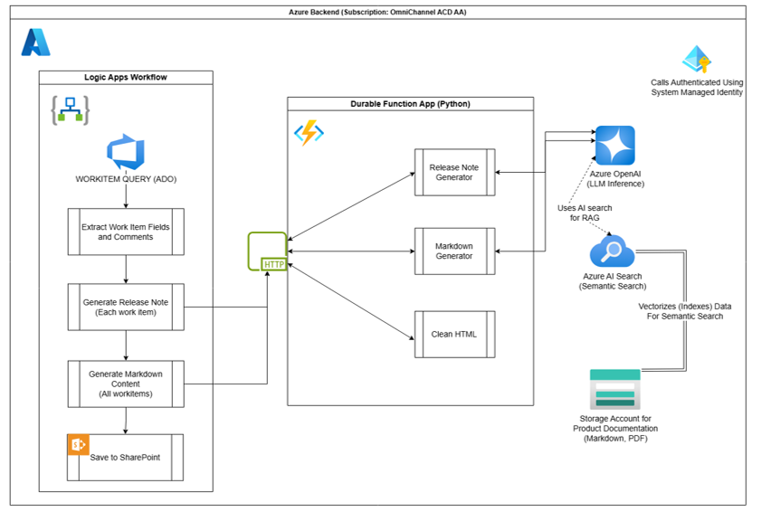

# AI Generated Release Notes

> **Automate your release notes generation with AI - Reduce manual effort by 70%**

An intelligent Azure-powered solution that automatically generates professional release notes from Azure DevOps work items using GenAI. Originally developed at Microsoft, this solution has been successfully deployed across multiple product teams.


## 📋 Table of Contents

- [Overview](#-overview)
- [Key Features](#-key-features)
- [Documentation](#-documentation)
- [Tech Stack](#️-tech-stack) 
- [Architecture](#️-architecture)
- [Getting Started](#-getting-started)
- [Usage](#-usage)
- [Results](#-results)
- [Contributing](#-contributing)
- [License](#-license)
- [Acknowledgments](#-acknowledgments)

## 🎯 Overview

This solution transforms the tedious process of creating release notes into an automated, AI-driven workflow. By integrating with Azure DevOps and leveraging advanced GenAI capabilities, it extracts work item data and generates professional, customer-ready release notes in Markdown format.

**Impact**: Reduced release note generation time by **70%** for Microsoft product teams.

## ✨ Key Features

- 🤖 **AI-Powered Generation**: Uses prompt-chained framework for intelligent content creation
- 🔍 **Smart Content Retrieval**: RAG-enabled semantic search of product documentation
- 🔗 **Azure DevOps Integration**: Direct integration with work item queries
- ⚡ **Logic Apps Workflow**: Seamless orchestration and automation
- 📝 **Markdown Output**: Clean, professional formatting ready for publication
- 🏢 **Enterprise Ready**: Built for Microsoft tenant with scalable architecture

## 📚 Documentation

- 📋 **[Presentation](./ReleaseNotesE2EAutomation.pdf)** - Complete solution overview
- 🛠️ **[Technical README](./release-notes-app/README.md)** - Detailed implementation guide for the backend Azure Functions
- 🚀 **[Onboarding Guide](./release-notes-app/Onboarding/README.md)** - Logic Apps workflow setup and configuration

## 🏗️ Tech Stack

- **Azure Functions** (Durable Functions Backend)
- **Azure Logic Apps** (Workflow that orchestrates operation and communicates with other components)
- **Azure OpenAI Service** (Deploying LLM model and AI search for semantic search)
- **Python** (Developing function app)
- **ARM Template** (Parameterized for quick onboarding)

## 🏗️ Architecture

### High Level Architecture
The solution uses Azure Logic Apps to orchestrate the entire workflow, calling Azure Functions APIs to process and generate release notes.



### Low Level Architecture
A sophisticated prompt-chained framework processes data through multiple stages, with RAG-enabled semantic search for enhanced accuracy.


## 🚀 Getting Started

### Prerequisites

- Azure subscription
- Azure DevOps organization
- Azure Logic Apps
- Azure OpenAI service access

### Quick Start

1. **Clone the repository**
   ```bash
   git clone https://github.com/yourusername/AI-Generated-Release-Notes.git
   cd AI-Generated-Release-Notes
   ```

2. **Deploy Azure Functions Backend**
   - Navigate to the function app directory: `cd release-notes-app`
   - Follow the detailed setup guide: [Release Notes App README](./release-notes-app/README.md)

3. **Configure Logic Apps Workflow (For Azure Subscription under Microsoft Tenant)**
   - Import the provided workflow template
   - Configure Azure DevOps, Outlook and SharePoint connections
   - Follow the [Onboarding Guide](./release-notes-app/Onboarding/README.md)

## 📖 Usage

The solution automatically:
1. Extracts work items from your Azure DevOps query
2. Processes the data through AI-powered analysis
3. Generates professional release notes in Markdown format
4. Outputs customer-ready documentation

**Example workflow**: Configure your Azure DevOps query → Run Logic Apps workflow → Receive generated release notes

## 📊 Results

See the dramatic improvement in release note quality and generation time:


**Key Improvements:**
- ⏱️ **70% time reduction** in release note generation
- 📈 **Consistent quality** across all releases
- 🎯 **Customer-focused language** through RAG integration
- 🔄 **Scalable process** for multiple product teams

## 🤝 Contributing

We welcome contributions! This project has already expanded to multiple Microsoft teams and continues to grow.

### How to Contribute
1. Fork the repository
2. Create a feature branch
3. Make your changes
4. Submit a pull request

### Areas for Contribution
- Additional Azure DevOps integrations
- Enhanced AI prompt engineering
- UI/UX improvements
- Documentation and examples

## 📄 License

This project is licensed under the MIT License - see the LICENSE file for details.

## 🌟 Acknowledgments

- Originally developed at Microsoft
- Successfully deployed across multiple product teams
- Continuing to expand to new organizations

---

⭐ **Star this repo** if it helps automate your release process!
