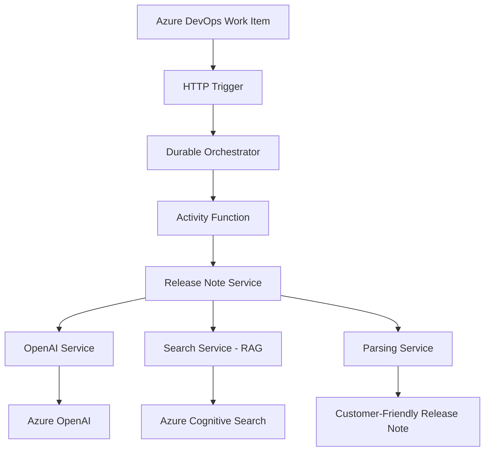
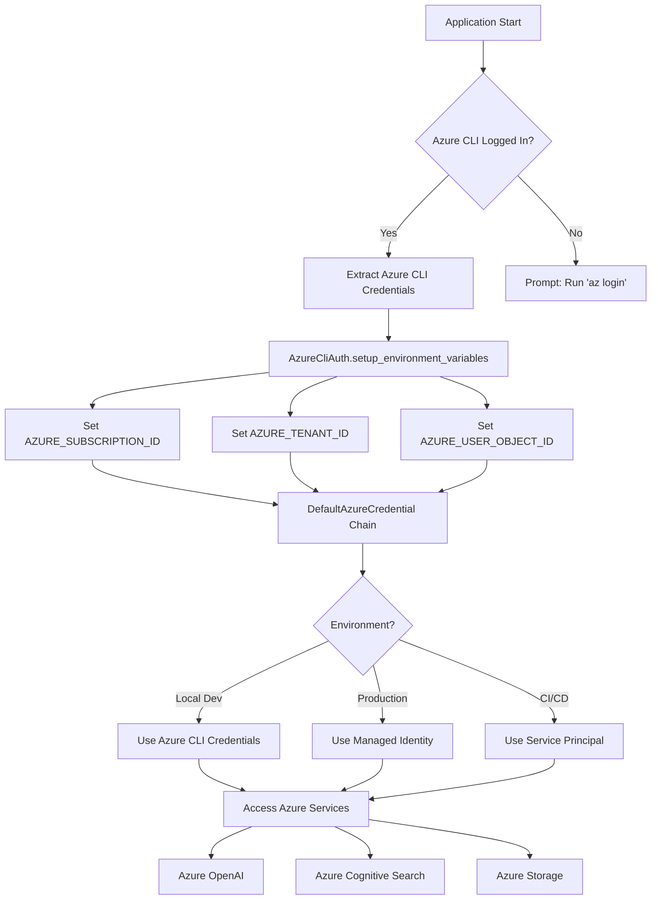

# 🚀 AI-Powered Release Notes Generator

[](https://azure.microsoft.com/en-us/services/functions/)
[](https://www.python.org/)
[](https://azure.microsoft.com/en-us/products/cognitive-services/openai-service/)
[](LICENSE)

A sophisticated Azure Functions application that automatically transforms technical Azure DevOps work items into customer-friendly release notes using AI and Retrieval-Augmented Generation (RAG).

## 📋 Table of Contents

- [🌟 Key Features](#-key-features)
- [🚀 Quick Onboarding](#-quick-onboarding)
- [🏗️ Architecture Overview](#️-architecture-overview)
- [📁 Project Structure](#-project-structure)
- [🚀 Quick Start](#-quick-start)
- [⚙️ Configuration](#️-configuration)
- [📡 API Reference](#-api-reference)
- [🧪 Testing](#-testing)
- [📊 Monitoring and Observability](#-monitoring-and-observability)
- [🔧 Troubleshooting](#-troubleshooting)
- [🚀 Deployment](#-deployment)
- [🤝 Contributing](#-contributing)
- [📜 License](#-license)
- [🙏 Acknowledgments](#-acknowledgments)

## 🌟 Key Features

- **🤖 AI-Powered Translation**: Converts technical jargon into customer-friendly language
- **📚 RAG Integration**: Enriches release notes with context from product documentation
- **⚡ Serverless Architecture**: Built on Azure Functions for scalability and cost-efficiency
- **🔄 Batch Processing**: Handles both single work items and bulk operations
- **📝 Markdown Output**: Generates properly formatted release notes
- **🛡️ Secure Authentication**: Uses Azure Managed Identity for secure service access
- **📊 Comprehensive Logging**: Enhanced logging and monitoring capabilities

## 🚀 Quick Onboarding

Looking to deploy this as an automated Logic App workflow? We provide a complete ARM template deployment solution!

### 📋 For Teams Wanting Automated Logic App Integration

If you want to integrate this with Azure DevOps, SharePoint, and Office 365 using Logic Apps (no manual API calls needed), check out our **complete onboarding guide**:

**📁 Location**: [`/Onboarding/README.md`](./Onboarding/README.md)

**🎯 What You Get**:
- ✅ **5-minute ARM template deployment**
- ✅ **Automated Azure DevOps work item fetching**  
- ✅ **Auto-generated release notes saved to SharePoint**
- ✅ **Email notifications to your team**
- ✅ **No coding required - just configuration**

**🔧 What You Need**:
- Azure subscription (Contributor role)
- Azure DevOps access
- SharePoint Online site
- Office 365 Outlook

### 📋 For Developers Wanting Function App Integration

If you want to integrate the Function App directly into your applications or build custom workflows, continue reading this README for:
- Local development setup
- API integration details  
- Custom deployment options
- Advanced configuration

> 💡 **Quick Start Recommendation**: Most teams should start with the [Logic App onboarding guide](./Onboarding/README.md) for the fastest deployment!

## 🏗️ Architecture Overview



### 🧩 Component Architecture

#### **Function App Layer** (`function_app.py`)
- **HTTP Trigger**: Receives work item data and initiates processing
- **Durable Orchestrator**: Manages the workflow and state
- **Activity Functions**: Execute business logic with retry capabilities

#### **Services Layer**
- **`ReleaseNoteService`**: Core business logic and workflow coordination
- **`OpenAIService`**: Azure OpenAI integration with prompt management
- **`SearchService`**: RAG operations using Azure Cognitive Search
- **`ParsingService`**: LLM response validation and structure parsing

#### **Models Layer** (`models/data_models.py`)
- Type-safe data structures using Pydantic
- Input validation and serialization
- Response models with proper typing

#### **Configuration Layer** (`config/`)
- **`settings.py`**: Environment configuration management
- **`prompts.py`**: AI prompt templates and optimization

#### **Utilities Layer** (`utils/`)
- Authentication, logging, validation, and monitoring utilities

### 🔐 Authentication Flow Architecture

The application implements a sophisticated authentication strategy using `DefaultAzureCredential`:



#### **Authentication Components**

- **`AzureCliAuth`** (`utils/azure_auth.py`): Utility class for Azure CLI integration
- **`DefaultAzureCredential`**: Azure Identity library for automatic credential resolution
- **Environment Variables**: Auto-populated from Azure CLI for seamless local development

#### **Credential Resolution Order**

1. **Environment Variables** (CI/CD scenarios)
2. **Managed Identity** (Azure deployment)
3. **Azure CLI** (local development)
4. **Interactive Browser** (fallback)

This design eliminates the need for API keys or connection strings in local development! 🎉

## 📁 Project Structure

```
releasenotesappsecure/
├── 📁 config/                 # Configuration management
│   ├── __init__.py
│   ├── settings.py           # Environment and application settings
│   └── prompts.py           # AI prompt templates
├── 📁 docs/                  # Documentation and reports
│   ├── README.md
│   ├── HTML_CLEANING_IMPLEMENTATION_SUMMARY.md
│   ├── REFACTOR_SUMMARY.md
│   ├── REFACTORING_SUCCESS_REPORT.md
│   └── orchestration_results.txt
├── 📁 examples/              # Client examples and usage patterns
│   ├── README.md
│   └── example_client.py     # Sample API client implementation
├── 📁 models/                # Data models and type definitions
│   ├── __init__.py
│   └── data_models.py        # Pydantic models for type safety
├── 📁 scripts/               # Utility scripts and demos
│   ├── README.md
│   └── demo_html_cleaner.py  # HTML cleaning functionality demo
├── 📁 services/              # Business logic and external integrations
│   ├── __init__.py
│   ├── openai_service.py     # Azure OpenAI integration
│   ├── parsing_service.py    # Response parsing and validation
│   ├── release_note_service.py # Core business logic
│   └── search_service.py     # RAG and document search
├── 📁 tests/                 # Test suite
│   ├── README.md
│   ├── __init__.py
│   ├── test_refactored_app.py
│   ├── test_default_params.py
│   ├── test_html_cleaner.py
│   ├── integration/          # Integration tests
│   └── manual/              # Manual testing utilities
├── 📁 tools/                 # Development tools and utilities
│   └── README.md
├── 📁 utils/                 # Shared utilities
│   ├── __init__.py
│   ├── azure_auth.py        # Azure authentication
│   ├── enhanced_logging.py  # Logging enhancements
│   ├── logging_config.py    # Logging configuration
│   └── validation.py        # Input validation utilities
├── function_app.py          # Main Azure Functions entry point
├── host.json               # Azure Functions host configuration
├── requirements.txt        # Python dependencies
└── README.md              # Project documentation
```

### Directory Purposes

- **`config/`** - Application configuration and prompt templates
- **`docs/`** - Project documentation, implementation guides, and reports
- **`examples/`** - Sample client code and usage examples
- **`models/`** - Type-safe data models using Pydantic
- **`scripts/`** - Utility scripts, demos, and development tools
- **`services/`** - Core business logic and external service integrations
- **`tests/`** - Comprehensive test suite with unit and integration tests
- **`tools/`** - Development tools and automation scripts
- **`utils/`** - Shared utility functions and helpers

## 🚀 Quick Start

### Prerequisites

- **Python 3.9+**
- **Azure Functions Core Tools v4**
- **Azure CLI** (for deployment)
- **Azure Subscription** with OpenAI and Cognitive Search services

### Local Development Setup

1. **Clone the repository**
   ```bash
   git clone https://github.com/tkishnani_microsoft/releasenotesappsecure.git
   cd releasenotesappsecure
   ```

2. **Authenticate with Azure CLI** 🔑
   ```bash
   az login
   # Set your subscription if you have multiple
   az account set --subscription "your-subscription-name"
   ```

3. **Install dependencies**
   ```bash
   pip install -r requirements.txt
   ```

4. **Configure local settings**
   ```bash
   cp local.settings.json.template local.settings.json
   # Edit local.settings.json with your Azure service endpoints only
   # (subscription, tenant, and user info are auto-detected from Azure CLI)
   ```

5. **Test Azure authentication setup**
   ```bash
   python -c "from utils.azure_auth import setup_azure_auth_for_local_dev; setup_azure_auth_for_local_dev()"
   ```
   
   **Expected Output:**
   - ✅ `Azure authentication configured successfully`
   - ✅ `Storage account permissions verified` (if permissions are set up)
   - ⚠️ `Storage account permissions need to be configured` (if permissions needed)
   
   If you see permission warnings, contact your Azure administrator to grant the required storage roles.

6. **Start the function app**
   ```bash
   func host start
   ```

7. **Test the application**
   ```bash
   python tests/integration/test_orchestration.py
   ```

## ⚙️ Configuration

### 🔐 Azure Authentication Setup

The application uses **Azure CLI integration** for simplified local development authentication. Most configuration values are automatically extracted from your Azure CLI session.

#### **Quick Setup (Recommended)**

1. **Login to Azure CLI** (if not already logged in):
   ```bash
   az login
   ```

2. **Set your subscription** (if you have multiple):
   ```bash
   az account set --subscription "your-subscription-name"
   ```

3. **Create your local settings** from the template:
   ```bash
   cp local.settings.json.template local.settings.json
   ```

4. **Update only the service endpoints** in `local.settings.json`:
   ```json
   {
     "IsEncrypted": false,
     "Values": {
       "AzureWebJobsStorage__accountName": "your-storage-account-name",
       "AzureWebJobsStorage__credential": "managedidentity",
       "FUNCTIONS_WORKER_RUNTIME": "python",
       "AzureWebJobsFeatureFlags": "EnableWorkerIndexing",
       "ENDPOINT_URL": "https://your-openai-endpoint.openai.azure.com/",
       "DEPLOYMENT_NAME": "your-deployment-name",
       "SEARCH_ENDPOINT": "https://your-search-service.search.windows.net"
     }
   }
   ```

#### **What Gets Configured Automatically** ✅

The `AzureCliAuth` utility automatically extracts these from Azure CLI:

| Setting | Source | Azure CLI Command |
|---------|--------|-------------------|
| `AZURE_SUBSCRIPTION_ID` | Current subscription | `az account show --query id` |
| `AZURE_TENANT_ID` | Current tenant | `az account show --query tenantId` |
| `AZURE_USER_OBJECT_ID` | Signed-in user | `az ad signed-in-user show --query id` |
| Resource group info | Storage account | `az storage account show --name <account>` |

#### **What You Need to Configure Manually** ⚙️

Only these service-specific endpoints require manual configuration:

| Setting | Purpose | Example |
|---------|---------|---------|
| `ENDPOINT_URL` | Azure OpenAI service endpoint | `https://my-openai.openai.azure.com/` |
| `DEPLOYMENT_NAME` | OpenAI model deployment name | `GPT-4` or `GPT-35-Turbo` |
| `SEARCH_ENDPOINT` | Azure Cognitive Search endpoint | `https://my-search.search.windows.net` |
| `AzureWebJobsStorage__accountName` | Storage account name | `mystorageaccount` |

#### **Required Azure Permissions**

Your Azure user needs these role assignments on the storage account:

- **Storage Blob Data Contributor**
- **Storage Queue Data Contributor** 
- **Storage Table Data Contributor**

The application will automatically check these permissions and provide setup commands if needed.

### Azure Resources Required

| Service | Purpose | Configuration |
|---------|---------|---------------|
| **Azure OpenAI** | AI text generation | GPT-4 or GPT-3.5-turbo deployment |
| **Azure Cognitive Search** | RAG document retrieval | Vector search enabled |
| **Azure Functions** | Serverless compute | Python 3.9+ runtime |
| **Azure Storage** | Function state management | Standard storage account |

## 📡 API Reference

### Start Release Note Generation

**Endpoint:** `POST /api/orchestrators/release_note_orchestrator`

**Request Body:**
```json
{
  "single": true,
  "payload": {
    "Id": "12345",
    "Title": "Fix customer authentication bug",
    "Description": "Updated password validation logic to handle special characters",
    "Comments": ["Fixed regex pattern", "Added unit tests"],
    "AreaPath": "Product\\Authentication\\Core",
    "WorkItemType": "Bug",
    "State": "Resolved"
  },
  "documentation": "{semantic-configuration-from-ai-search-resource}"
}
```

**Response:**
```json
{
  "id": "abc123-def456-ghi789",
  "statusQueryGetUri": "http://localhost:7071/runtime/webhooks/durabletask/instances/abc123-def456-ghi789",
  "sendEventPostUri": "http://localhost:7071/runtime/webhooks/durabletask/instances/abc123-def456-ghi789/raiseEvent/{eventName}",
  "terminatePostUri": "http://localhost:7071/runtime/webhooks/durabletask/instances/abc123-def456-ghi789/terminate",
  "purgeHistoryDeleteUri": "http://localhost:7071/runtime/webhooks/durabletask/instances/abc123-def456-ghi789"
}
```

### Check Orchestration Status

**Endpoint:** `GET /runtime/webhooks/durabletask/instances/{instanceId}`

**Success Response:**
```json
{
  "name": "ReleaseNoteOrchestrator",
  "instanceId": "abc123-def456-ghi789",
  "runtimeStatus": "Completed",
  "input": {...},
  "customStatus": null,
  "output": {
    "success": true,
    "release_note": "Password validation now supports special characters, improving account security.",
    "processing_time": 12.34,
    "work_item_id": "12345"
  },
  "createdTime": "2024-01-15T10:30:00Z",
  "lastUpdatedTime": "2024-01-15T10:30:12Z"
}
```

### Bulk Processing

For multiple work items, set `"single": false` and provide an array in the `payload` field.

### HTML Content Cleaning

**Endpoint:** `POST /api/clean-html`

Clean HTML content and extract plain text using BeautifulSoup.

**Request Body (JSON):**
```json
{
  "html": "<div><p>Hello <b>World</b>!</p><script>alert('test');</script></div>",
  "preserve_structure": false,
  "remove_attributes": true
}
```

**Parameters:**
- `html` (required): The HTML content to clean
- `preserve_structure` (optional): Whether to preserve HTML structure (default: false)
- `remove_attributes` (optional): Whether to remove HTML attributes (default: true)

**Response:**
```json
{
  "cleaned_text": "Hello World!",
  "original_length": 65,
  "cleaned_length": 12,
  "processing_time_ms": 15.23,
  "preserve_structure": false
}
```

**Endpoint:** `POST /api/clean-html-file`

Clean HTML content from uploaded files.

**Request:** Send HTML content as raw text in the request body.

**Response:**
```json
{
  "cleaned_html": "<html><body><h1>Title</h1><p>Content</p></body></html>",
  "plain_text": "Title Content",
  "original_length": 200,
  "cleaned_html_length": 50,
  "plain_text_length": 13,
  "processing_time_ms": 25.67
}
```

### Health Check

**Endpoint:** `GET /api/health`

**Response:**
```json
{
  "status": "healthy",
  "service": "release-notes-generator"
}
```

## 🧪 Testing

### Integration Tests

Run the comprehensive integration test:

```bash
# Direct execution
python tests/integration/test_orchestration.py

# Using pytest
python -m pytest tests/integration/test_orchestration.py -v

# With detailed logging
python -m pytest tests/integration/test_orchestration.py -v -s
```

### Manual Testing

Test individual components:

```bash
# Test enhanced logging
python tests/manual/test_enhanced_logging.py

# Test refactored application
python tests/test_refactored_app.py
```

## 📊 Monitoring and Observability

### Logging Levels

The application implements structured logging with multiple levels:

- **`INFO`**: Normal operation flow and milestones
- **`ERROR`**: Errors and exceptions with context
- **`DEBUG`**: Detailed debugging information
- **`WARNING`**: Non-critical issues and fallbacks

### Key Metrics to Monitor

- **Response Times**: Track AI service response times
- **Success Rates**: Monitor successful release note generations
- **Token Usage**: Track OpenAI token consumption for cost optimization
- **Error Rates**: Monitor failure patterns and retry behavior

### Sample Log Output

```json
{
  "timestamp": "2024-01-15T10:30:00Z",
  "level": "INFO",
  "function_name": "ReleaseNoteOrchestrator",
  "instance_id": "abc123-def456-ghi789",
  "work_item_id": "12345",
  "processing_step": "AI_GENERATION",
  "message": "Generated release note successfully",
  "duration_ms": 2340,
  "token_usage": {
    "prompt_tokens": 450,
    "completion_tokens": 89,
    "total_tokens": 539
  }
}
```

## 🔧 Troubleshooting

### Common Issues and Solutions

| Issue | Symptoms | Solution |
|-------|----------|----------|
| **Azure CLI Not Logged In** | `AUTH: User is NOT logged in to Azure CLI` | Run `az login` to authenticate |
| **Wrong Subscription** | Permission errors, resource not found | Run `az account set --subscription "correct-subscription"` |
| **Missing Storage Permissions** | ⚠️ Storage account permissions need configuration | Contact your Azure admin to grant required roles (see below) |
| **Authentication Failures** | 401/403 errors in production | Verify Managed Identity permissions on Azure services |
| **Search Service Errors** | "Index not found" | Check semantic configuration names in Azure Cognitive Search |
| **Parsing Errors** | Malformed JSON responses | Review AI response formats in logs; check prompt templates |
| **Timeout Issues** | Long-running orchestrations | Increase timeout values in `host.json` |
| **Memory Issues** | Out of memory errors | Optimize prompt sizes and batch processing |

### Azure Authentication Troubleshooting

#### **Check Azure CLI Status**
```bash
# Verify you're logged in
az account show

# List available subscriptions
az account list --output table

# Check current user info
az ad signed-in-user show --query "{displayName:displayName, userPrincipalName:userPrincipalName, id:id}"
```

#### **Storage Account Permission Issues**

If you see permission warnings, your admin needs to grant these roles:

```bash
# Get your user object ID
USER_OBJECT_ID=$(az ad signed-in-user show --query id -o tsv)

# Grant required storage roles (admin must run these)
az role assignment create --assignee $USER_OBJECT_ID --role "Storage Blob Data Contributor" --scope "/subscriptions/{subscription}/resourceGroups/{rg}/providers/Microsoft.Storage/storageAccounts/{storage-account}"
az role assignment create --assignee $USER_OBJECT_ID --role "Storage Queue Data Contributor" --scope "/subscriptions/{subscription}/resourceGroups/{rg}/providers/Microsoft.Storage/storageAccounts/{storage-account}"
az role assignment create --assignee $USER_OBJECT_ID --role "Storage Table Data Contributor" --scope "/subscriptions/{subscription}/resourceGroups/{rg}/providers/Microsoft.Storage/storageAccounts/{storage-account}"
```

#### **Verify Authentication Setup**

Test the authentication utilities directly:

```bash
# Test Azure auth setup
python -c "from utils.azure_auth import setup_azure_auth_for_local_dev; setup_azure_auth_for_local_dev()"
```

This will show detailed information about your authentication status and any missing permissions.

### Debug Mode

Enable debug logging by setting environment variable:

```bash
# Local development
export AZURE_FUNCTIONS_ENVIRONMENT=Development

# In local.settings.json
{
  "Values": {
    "AZURE_FUNCTIONS_ENVIRONMENT": "Development"
  }
}
```

## 🚀 Deployment

### Azure Deployment

1. **Create Azure Resources**
   ```bash
   # Create resource group
   az group create --name rg-release-notes --location eastus

   # Create function app
   az functionapp create \
     --resource-group rg-release-notes \
     --consumption-plan-location eastus \
     --runtime python \
     --runtime-version 3.9 \
     --functions-version 4 \
     --name your-function-app-name \
     --storage-account yourstorageaccount
   ```

2. **Configure Managed Identity**
   ```bash
   # Enable system-assigned managed identity
   az functionapp identity assign --name your-function-app-name --resource-group rg-release-notes
   ```

3. **Deploy Function Code**
   ```bash
   func azure functionapp publish your-function-app-name
   ```

4. **Configure Application Settings**
   ```bash
   az functionapp config appsettings set \
     --name your-function-app-name \
     --resource-group rg-release-notes \
     --settings \
     ENDPOINT_URL="https://your-openai-endpoint.openai.azure.com/" \
     DEPLOYMENT_NAME="your-deployment-name" \
     SEARCH_ENDPOINT="https://your-search-service.search.windows.net"
   ```

### CI/CD Pipeline

Consider implementing Azure DevOps or GitHub Actions for automated deployment:

```yaml
# .github/workflows/deploy.yml
name: Deploy Azure Function

on:
  push:
    branches: [ main ]

jobs:
  deploy:
    runs-on: ubuntu-latest
    steps:
    - uses: actions/checkout@v2
    - uses: azure/functions-action@v1
      with:
        app-name: your-function-app-name
        package: .
```

## 🤝 Contributing

We welcome contributions! Please follow these guidelines:

### Development Workflow

1. **Fork the repository**
2. **Create a feature branch**
   ```bash
   git checkout -b feature/your-feature-name
   ```
3. **Make your changes following the coding standards**
4. **Add tests for new functionality**
5. **Update documentation as needed**
6. **Submit a pull request**

### Coding Standards

- **Type Hints**: Use comprehensive type annotations
- **Docstrings**: Follow Google-style docstring format
- **Error Handling**: Implement proper exception handling with logging
- **Testing**: Add unit and integration tests for new features
- **Logging**: Include appropriate logging for debugging and monitoring

### Code Review Checklist

- [ ] Code follows established patterns and architecture
- [ ] All functions have type hints and docstrings
- [ ] Error handling is comprehensive
- [ ] Tests cover new functionality
- [ ] Logging is appropriate and structured
- [ ] Documentation is updated

### Performance Metrics

#### Typical Performance

- **Single Work Item**: 8-15 seconds end-to-end
- **Bulk Processing (10 items)**: 2-5 minutes
- **Token Usage**: 300-800 tokens per work item
- **Success Rate**: >95% with proper configuration

#### Optimization Tips

- Use appropriate prompt templates for your domain
- Configure semantic search indexes properly
- Monitor token usage for cost optimization
- Implement caching for frequently accessed documentation

## 📜 License

This project is licensed under the MIT License - see the [LICENSE](LICENSE) file for details.

## 🙏 Acknowledgments

- Built with [Azure Functions](https://azure.microsoft.com/en-us/services/functions/)
- Powered by [Azure OpenAI](https://azure.microsoft.com/en-us/products/cognitive-services/openai-service/)
- Enhanced with [Azure Cognitive Search](https://azure.microsoft.com/en-us/services/search/)
- Developed with modern Python best practices

---

**For questions, issues, or contributions, please open an issue or contact the development team.**
